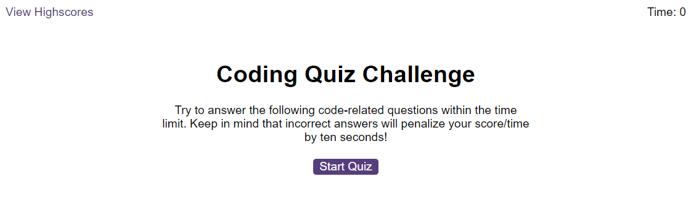
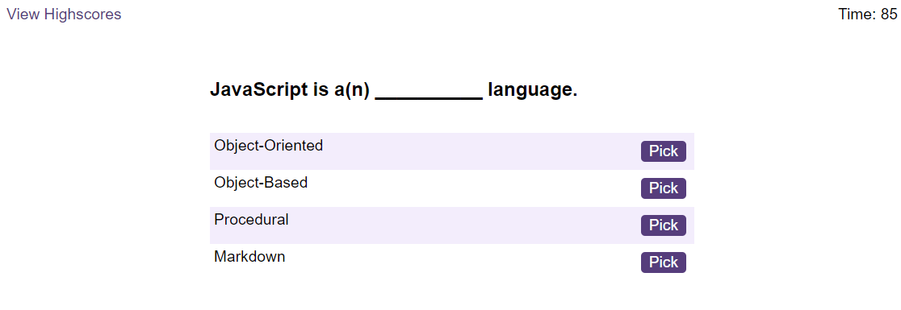
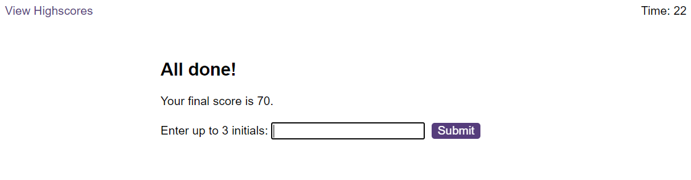

# JS_Quiz_AP

This application is a quiz game, built predominantly in JavaScript. The user is presented with 10 multiple choice questions about JavaScript, and is scored based on their answers.

​[Deployed Application](https://lxpap.github.io/JS_Quiz_AP)

## Installation

No installation is necessary for this application.

## Usage

In order to use this application, you start by clicking the "Start" button after reading the instructions. You will then be presented with a multiple choice question about JavaScript. Once you pick your answer, you will hear a sound denoting on whether it was correct or not. If it was not correct, 10 seconds will be deducted from the time left to complete the quiz, visible on the top right corner. Regardless of if correct or not, a new question will appear, and this process will repeat for a total of 10 questions. Once done, you will be presented with your score and the ability to add your initials to register your score, and maybe make it to the highscores board!

   

   

## Credits

Information and research to aid development was done using the following resources:

[StackOverflow](https://stackoverflow.com/)

[MDN](https://developer.mozilla.org/en-US/)

[Google Bard](https://bard.google.com/)

[Interviewbit](https://www.interviewbit.com/javascript-mcq/)

## License

A copy of the MIT License can be found in this repository.
